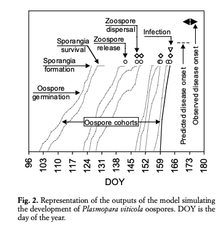

# vineyard

## Setup

### Credentials

All credentials should be put in a `credentials.py` file in the root directory. At the moment the following credentials are defined:

```
username = {username to login to weather station}
password = {password to login to weather station}
```

### Virtual environment

First create a [virtual environment](https://docs.python.org/3/tutorial/venv.html):

```
python3 -m venv venv
```

Activate this virtual environment:

```
source venv/bin/activate
```

Install the packages in `requirements.txt` (this file contains a list of packages with the version used):

```
pip install -r requirements.txt
```

To add more packages to `requirements.txt`:

```
pip install {package}
pip freeze > requirements.txt
```

## Data

### Python

You can get the latest data by running `python fetch-weather-station-data.py`.

The script is based on 3 requests:

* login (gives session_id)
* details (uses session_id and gives export_id)
* download (uses export_id and session_id)

Seems like details endpoint is unprotected.

The form data string for details is crazy long but that whole query is badly designed.

export_id depends on time range selected but fixed on this year to make things easier (the details query is crazy complex).

export_id full year: export_bf61e26e96de4a449c2097a6d3e84508
export_id 12/08: bf61e26e96de4a449c2097a6d3e84508

Impossible to get token generated by [Javascript](https://stackoverflow.com/questions/29928591/not-getting-all-cookie-info-using-python-requests-module). Other option is to web scrape the page.

### Puppeteer

Install package.json like requirements.txt with npm install.

Selection based on [id](https://developer.mozilla.org/en-US/docs/Web/CSS/CSS_Selectors).

[Puppeteer recorder](https://github.com/checkly/puppeteer-recorder) is a handy tool to record steps.

https://pptr.dev/

You have to use method `page.waitForSelector()` if you change tab/login, ... 

Run the script `node fetch-weather-station-data.js`

Provide credentials in file `credentials.js` in format:

```
module.exports = {
    username: 'username',
    password: 'password'
}
```

[Good tutorial](https://medium.com/@e_mad_ehsan/getting-started-with-puppeteer-and-chrome-headless-for-web-scrapping-6bf5979dee3e)

Do not set [input value](https://stackoverflow.com/questions/47966510/how-to-fill-an-input-field-using-puppeteer) with `page.type()`.

### Database

Make sure to have mysql installed (`mysql --version` should return something).

Have sql [server running](https://stackoverflow.com/questions/7927854/start-mysql-server-from-command-line-on-mac-os-lion):

```
mysql.server start
```

Run `mysql -u root` to enter console. Root server is available by default in mysql. You can run a script using `source script` and see output with `show` like `show database` or `show tables`.

[Cheatsheet](https://www.ntu.edu.sg/home/ehchua/programming/sql/MySQL_Beginner.html)

Explanation how to [save database](https://dev.mysql.com/doc/refman/5.7/en/mysqldump-sql-format.html).

#### Test data

Shell script to seed test data:

```
./seed-test-data.sh
```

Don't forget to make it executable using `chmod u+x`. 

#### Schemas

Database used is [mysql](https://www.elated.com/mysql-for-absolute-beginners/).

Input database schema:

Output database schema:

We use `TINYINT(1)` as type instead of `BOOLEAN` since `BOOLEAN` does not exist in [mysql](http://www.mysqltutorial.org/mysql-data-types.aspx).

#### Connect mysql with Python

Python has a [mysql connector](https://www.datacamp.com/community/tutorials/mysql-python).

[Examples](https://dev.mysql.com/doc/connector-python/en/connector-python-examples.html) how to connect.

Preferred to use sqlite3 over mysql since:

- it's built into Python
- no need for a separate server

#### sqlite

version used is `3.24.0`

[cli explanation](https://sqlite.org/cli.html)

Create database:

```
touch vineyard.db
sqlite3 vineyard.db
```

To run script in sqlite3:

```
sqlite3 vineyard.db < script.sql
```

## Service

Run Flask:

```
env FLASK_APP=model-output-service.py flask run
```

Endpoints can return either html (to display tables, ...) or straight json (to be used by a front-end framework) depending on what's specified in the `Accept` header.

Threshold are query parameters (because [filtering](https://medium.com/@fullsour/when-should-you-use-path-variable-and-query-parameter-a346790e8a6d)) to the endpoint instead of fixed values in a config file. This in order to:

* be more flexible
* make testing easier since you can specify different test cases

## Tests

At the moment the only tests available are tests for the service in Postman.

To run these tests:

```
cd tests;
newman run vineyard.postman_collection.json -e local.postman_environment.json
```

Make sure the service is running in the same environment as the tests. E.g. use environment local in Postman if you run the service on localhost.

Tests are based on the test data in `insert-test-data.sql`.

## Background

### Downey mildew

*Plasmopara viticola* causes downy mildew. Mostly occurs in rainy areas (e.g. Belgium). *Plasmopara viticola* has 2 infection cycles:

* asexual (primary infection)
* sexual (secundary infection)

 Since the disease spreads very fast during the secondary infection cycles, successful control depends on controlling the primary infections.

### 3-10 rule

Traditionally the *3-10* rule is used as a "model". This rule says there will be an infection when:

* temperature > 10 degrees
* vine shoots > 10 cm
* 10 mm of rainfall in last 24-48 hours
* 
The *3-10* rule can be assumed to be a minimum acceptancecriterium for our own model. In addition it can be usedas a sanity check for our own model. If our own modeldeviates too far from the rule it probably meanssomething is wrong with our model and not the rule(although the rule is far from perfect).

### mechanistic model

The model simulates the infection process from germination to symptoms.



When weather conditions are favourable (e.g. high temperature, enough rainfall) a cohort will be simulated until disease appearance; otherwise, the simulation for the cohort stops at any stage of pathogen development. 

Important is cohorts are used because that's what they had modelling problems with in Excel. The issue is multiple cohorts can be developing at the same time.

### input variables

Weather variables are logged by a weather station in the vineyard. These weather variables are the input of the model.

### Goal

Goal is to get each hour an estimate of the probability of downy mildew using a mechanistic model detailed in the following papers:

* A model predicting primary infections of Plasmopara viticola in different grapevine-growing areas of Italy
* A mechanistic model simulating primary infections
of downy mildew in grapevine

Based on this probability notifications are sent.

A secundary goal is to visualize the actions taken, input variables and mildew probability.

## Verification model

The dependent variable (the presence of downy mildew) is not present in the data set provided. It is thus impossible to verify the model.

## Data sources

## Data contract

## Requirements

* modular
* hourly updates
* configurable
* model should not be black-box
* model can be tweaked
* logging
 
Configurable in the sense you have to be able to specify fixed parameters for the model like:

* type of terrain
* type of grape
* sensitivity
* type of pesticide used

Sensitivity refers to giving certain variables more weight than others based on the state of the terrain the previous year (e.g. the surface is still very wet so put more emphasis on rainfall than temperature)

Model should not be black-box so people can be convinced of its value. 

The model should be tweaked next year based on the results of this year.

Logging:

* when pesticide was used
* presence/absence of downy mildey

## Modules

* model
* service
* notifications
* web app

Advantage of using a service here:

* both notifications and web app don't need to know directly about how the model works
* safety checks can be made on the data
* easier to test

The service can be written in [Flask](https://palletsprojects.com/p/flask/).

Notifications can be done either with:

* the `notifiers` library
* native implementation of an app

The web app itself can be done with:

* Flask in combination with a templating engine
* web framework like [Vue](https://vuejs.org/)

If we use Flask to render the data the page will be static. If we use a web framework dynamic options are possible.

These libraries are chosen because they have a minimalistic vision enabling us to:

* write code that's easy to understand by others
* quickly set up a proof of concept

## Downy mildey

[Wikipedia explanation](https://en.wikipedia.org/wiki/Downy_mildew)

The pathogen tends to become established in late summer.

Therefore, planting early season varieties may further reduce the already minor threat posed by downy mildew.

One way to control downy mildew is to eliminate moisture and humidity around the impacted plants

## Deliverables

* application
* documentation
  * how to configure model
  * how to deploy app
* basic tests

## Variables model

- relative humidity
- temperature
  - min
  - max
  - average
- wetness leaf (bladnat)
- light
- barrometric pressure

barometric pressure: predict state variables like temperature, rainfall coming days 


## Notifications

Spraying should be done if both:

* model predictions exceed threshold
* hasn't been sprayed for at least a certain time

This certain time has be to verified (let's take a week as an example).

There's a Python library called [notifiers](https://github.com/notifiers/notifiers) which seems well maintained. It's a wrapper around several popular notification application.

Another option is to use the native Python library of a notification application. E.g. [Simplepush](https://simplepush.io/) seems a good match.

Simple test Simplepush which sends a notification to your phone. 5nCvuY is my username.

```
curl 'https://api.simplepush.io/send/5nCvuY/Wow/So easy'
```


